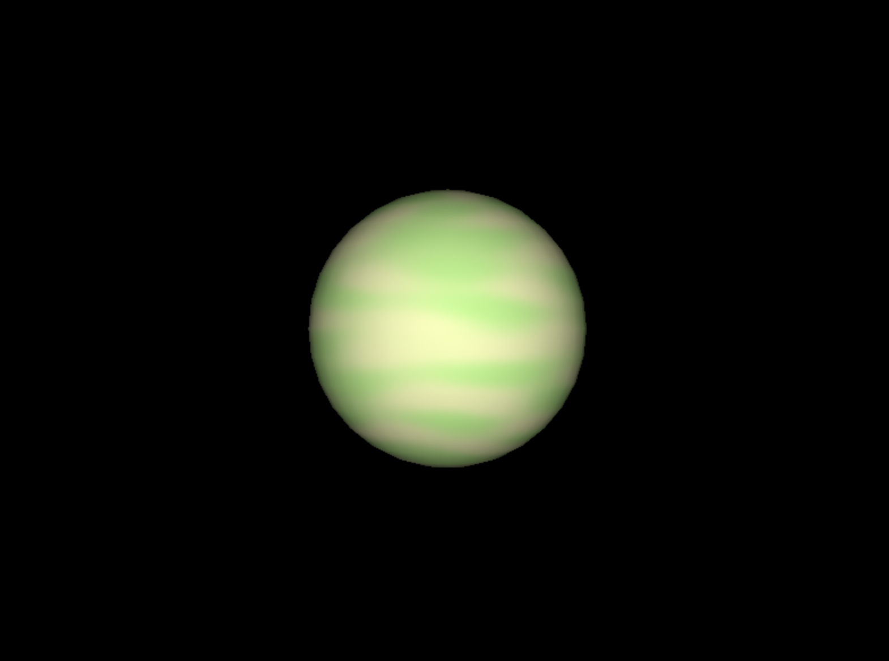
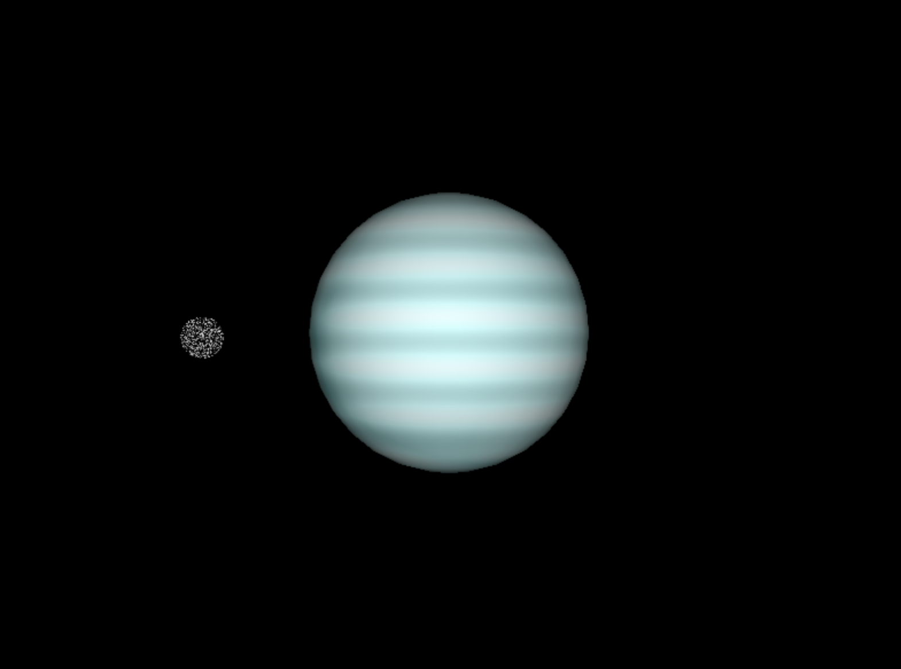
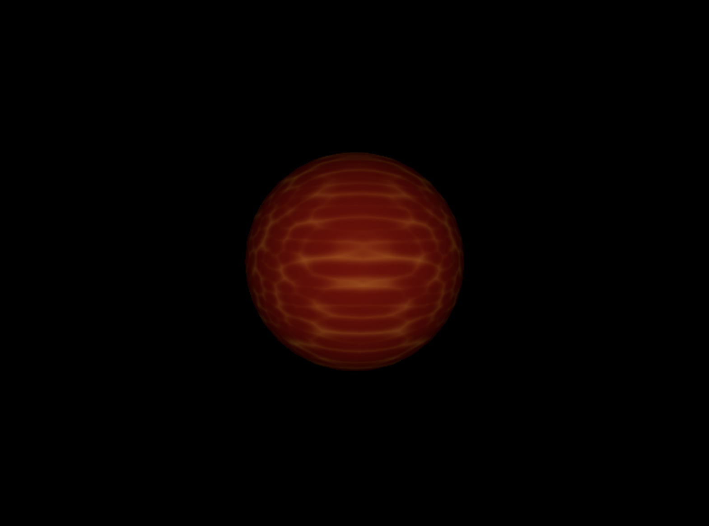
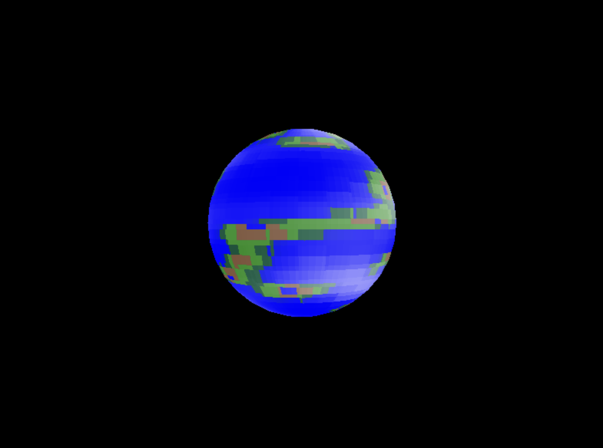
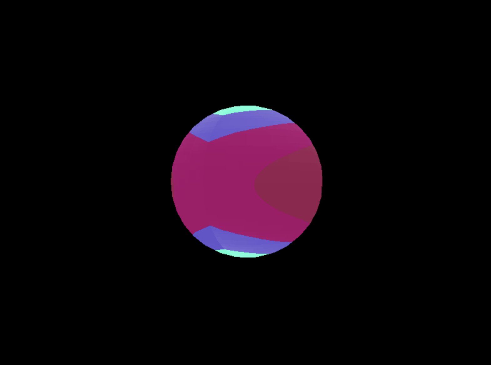
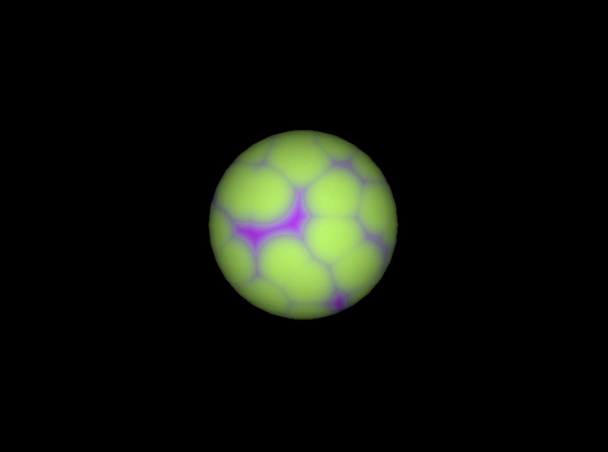

# L4-GS
# Renderer using SDL and GLM

This project is a software renderer built using the SDL and GLM libraries. It showcases the rendering of 3D models using various shaders.

## Sample Renders

Here are some sample renders produced by this software:

### Greene shader

### Gas shader with moon

### Sun shader

### Rocky shader

### Ball shader

### Neon shader

## Features

- Vertex and Fragment Shading
- Model Loading using OBJ files
- Various shaders including:
    - Greene Shader
    - Gas Shader
    - Sun Shader
    - Land Shader
    - Ball Shader
    - Neon Shader
    - Stars Shader

## Requisitos cumplidos
- [Criterio subjetivo] 30 puntos según la creatividad de su diseño.
- 40 puntos. 10 puntos por cada “capa” del shader que afecte el color. 4 capas les daría todos los puntos.
- 30 puntos. 10 puntos por cada planeta extra que diseñen más allá de los 3 requeridos por el ejercicio para un máximo de 30 puntos
- 20 puntos por implementar una luna en un planeta rocoso
- Total: 120 puntos